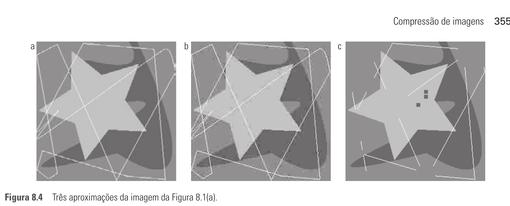
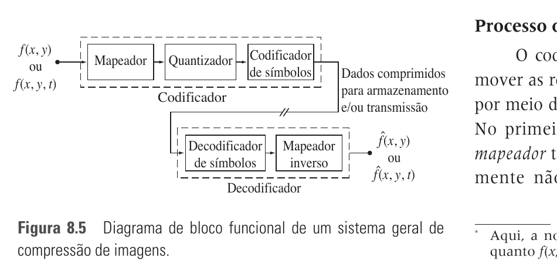

# 8.1 — Fundamentos da Compressão de Imagens

> Gonzalez & Woods, 3ª ed., cap. 8, p. 348–356 (PDF 366–374)
> ⭐ Contém o **MSE/RMS** (critério de fidelidade da **Q1a**) e a **entropia** (Q5).

**Compressão** = reduzir o volume de dados para representar a mesma informação,
eliminando **redundância**.

## Taxa de compressão e redundância relativa
Se `b` = nº de bits da representação original e `b'` = da comprimida:

```
Taxa de compressão:      C = b / b'        (ex.: 10:1 → 10 bits viram 1)
Redundância relativa:    R = 1 − 1/C
```

## 8.1.1–8.1.3 Os três tipos de redundância

| # | Redundância | O que é | Como reduzir |
|---|-------------|---------|--------------|
| 8.1.1 | **de codificação** | usar mais bits que o necessário p/ os símbolos (código de tamanho fixo ignora probabilidades) | **código de tamanho variável** (Huffman: símbolo frequente → código curto) |
| 8.1.2 | **espacial e temporal** | pixels vizinhos (ou quadros vizinhos, em vídeo) são correlacionados → informação repetida | **run-length**, **preditiva** (diferenças), transformada |
| 8.1.3 | **informação irrelevante** | dados que o olho humano ignora ou inúteis p/ o fim | **quantização** (descarta → com perda) |

## 8.1.4 Medindo a informação (entropia)

Informação de um evento `E` com probabilidade `P(E)`:
```
I(E) = −log P(E)      (base 2 → bits).   P=1 → I=0;   P=½ → I=1 bit
```

**Entropia** de uma fonte de memória zero com símbolos `{a₁…a_J}`:
```
H = − Σ P(aⱼ) log₂ P(aⱼ)      (bits/símbolo)
```

- É o **limite inferior** médio de bits/pixel para codificação sem perda
  (teorema de Shannon). Nenhum código sem perda faz melhor que `H` em média.
- Fonte com memória (pixels dependentes) = fonte de Markov (H condicional menor).

## 8.1.5 Critérios de fidelidade (para compressão COM perda) ⭐ Q1a

Como medir o quanto a imagem reconstruída `f̂` difere da original `f`.

**Objetivos** (numéricos). Erro por pixel: `e(x,y) = f̂(x,y) − f(x,y)`.

**Erro quadrático médio (MSE):**
```
MSE = (1/MN) Σₓ Σy [ f̂(x,y) − f(x,y) ]²
```

**Erro RMS** = raiz do MSE:
```
e_rms = √( (1/MN) Σₓ Σy [ f̂(x,y) − f(x,y) ]² )
```

- Também usa-se **SNR_rms** (relação sinal–ruído).
- Menor erro rms ⇒ maior qualidade (mas nem sempre bate com a percepção).

**Subjetivos** — nota de humanos numa escala (ex.: excelente…péssimo). Captam
qualidade percebida que o erro numérico não vê.



> 🎯 **Q1a:** aplica-se Delta Modulation (compressão preditiva), reconstrói-se a
> imagem `f̂` e calcula-se o **MSE** entre `f̂` e a original `f` com a fórmula acima.
> Para um bloco pequeno: soma dos quadrados das diferenças ÷ nº de pixels.

## 8.1.6 Modelo de compressão

Dois blocos: **codificador** e **decodificador**.

```
CODIFICADOR:  f → [Mapeador] → [Quantizador] → [Codificador de símbolos] → dados comprimidos
DECODIFICADOR: dados → [Decodificador de símbolos] → [Mapeador inverso] → f̂
```



- **Mapeador** — transforma `f` p/ reduzir redundância espacial/temporal (ex.:
  run-length, transformada). Geralmente **reversível**.
- **Quantizador** — reduz a precisão p/ eliminar info irrelevante. **Irreversível**
  → é o estágio que introduz **perda** (omitido na compressão sem perda).
- **Codificador de símbolos** — código de tamanho variável (Huffman) p/ atacar a
  redundância de codificação. Reversível.

**Sem perda (lossless):** `f̂ = f` exatamente (só mapeador + símbolos, sem quantizador).
**Com perda (lossy):** `f̂ ≠ f`, mede-se por critério de fidelidade. (JPEG, vídeo.)

## 8.1.7 Formatos, contêineres e padrões

- **Formato de arquivo** — forma padrão de organizar/armazenar os dados (define
  organização + compressão usada). Ex.: JPEG, PNG, TIFF.
- **Contêiner** — como um formato, mas lida com vários tipos de dados de imagem.
- **Padrão de compressão** — define os procedimentos de compressão/descompressão
  (ex.: JPEG, MPEG).

## Fio condutor

```
Comprimir = remover redundância:
  codificação (Huffman) · espacial/temporal (run-length, preditiva) · irrelevante (quantização)
Entropia H = −Σ P log₂ P   → limite da compressão sem perda
Qualidade (com perda): MSE = (1/MN) Σ (f̂−f)²  ,  e_rms = √MSE   ← Q1a
Modelo: Mapeador → Quantizador(perda) → Cod. símbolos  |  inverso no decoder
```
