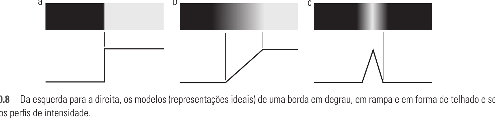
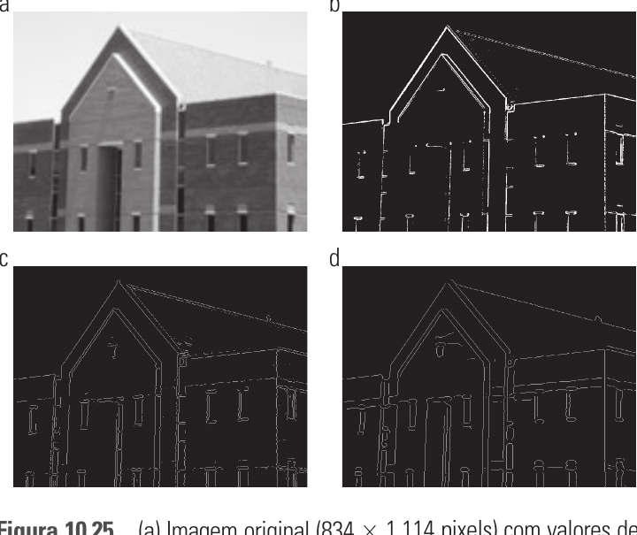
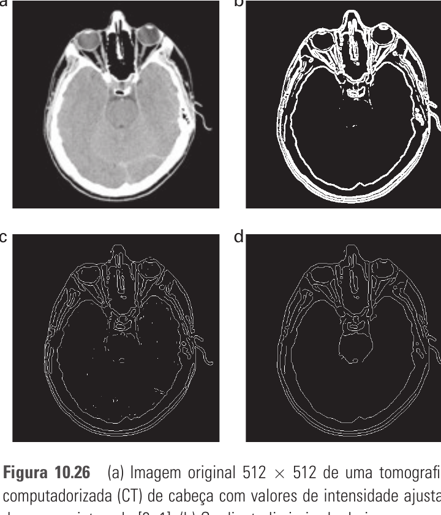

# 10.2 — Detecção de Ponto, Linha e Borda

> Gonzalez & Woods, 3ª ed., cap. 10, p. 456–485 (PDF 474–503)

Categoria da **descontinuidade**. Detecta 3 tipos de característica por mudança
abrupta de intensidade: **pontos isolados, linhas e bordas**. Ferramenta base:
**derivadas** implementadas por convolução com máscaras.

## 10.2.1 Fundamentos — derivadas

Suavizar (média) ~ integrar; detectar mudança ~ **derivar**.

| Derivada | Regra | Uso |
|----------|-------|-----|
| **1ª ordem** (gradiente) | =0 em área constante; ≠0 no início de degrau/rampa e ao longo da rampa | **onde** há borda (produz bordas grossas) |
| **2ª ordem** (Laplaciano) | =0 em área constante; ≠0 no **início e fim** de degrau/rampa; =0 ao longo da rampa | localização fina + **cruzamento por zero**; resposta dupla (produz linha fina) |

- 1ª derivada digital: `∂f/∂x = f(x+1) − f(x)`.
- 2ª derivada digital: `∂²f/∂x² = f(x+1) + f(x−1) − 2f(x)`.
- 2ª derivada é **mais sensível a ruído** que a 1ª.

## 10.2.2 Detecção de pontos isolados

Usa o **Laplaciano**. Máscara 3×3:

```
 1  1  1        0  1  0
 1 -8  1   ou   1 -4  1   (sem diagonais)
 1  1  1        0  1  0
```

Detecta ponto: `|R| ≥ T`, onde `R` = resposta da máscara e `T` = limiar. Ponto = pixel destoante do fundo em todas as direções.

## 10.2.3 Detecção de linhas

Laplaciano também acha linhas (mas dá resposta dupla). Melhor: **máscaras direcionais** — uma por orientação (horizontal, +45°, vertical, −45°):

```
Horizontal      +45°           Vertical        −45°
-1 -1 -1        -1 -1  2       -1  2 -1        2 -1 -1
 2  2  2        -1  2 -1       -1  2 -1       -1  2 -1
-1 -1 -1         2 -1 -1       -1  2 -1       -1 -1  2
```

Resposta máxima na máscara cuja orientação coincide com a da linha. Para achar linhas de uma direção `k`: aplicar a máscara e limiarizar `|Rk|`.

## 10.2.4 Modelos de borda

Bordas classificadas pelo perfil de intensidade:

- **Degrau (step)** — transição ideal em 1 pixel. Modelo teórico.
- **Rampa (ramp)** — transição gradual (borda real, borrada). Inclinação ∝ nitidez.
- **Telhado (roof)** — sobe e desce; é uma **linha fina** (ex.: estrada em imagem de satélite).



Relação com derivadas na rampa:
- **magnitude do gradiente** → grossa, constante ao longo da rampa.
- **Laplaciano** → cruza o zero no ponto médio da rampa (localiza o centro da borda) e tem sinal oposto dos dois lados.

Ruído destrói derivadas → **suavizar antes** é essencial.

## 10.2.5 Detecção básica de bordas (gradiente)

Gradiente: `∇f = [gx, gy]`. Magnitude `M(x,y) = √(gx²+gy²)` (aprox. `|gx|+|gy|`).
Direção `α(x,y) = atan2(gy, gx)`. A **borda é ortogonal** à direção do gradiente.

Máscaras (região 3×3 rotulada z1..z9, linha a linha):

- **Roberts** (2×2, gradiente cruzado): `gx = z9 − z5`, `gy = z8 − z6`.
- **Prewitt** (3×3):
  `gx = (z7+z8+z9) − (z1+z2+z3)` · `gy = (z3+z6+z9) − (z1+z4+z7)`
- **Sobel** (3×3, peso **2** no centro → suaviza melhor):
  `gx = (z7+2z8+z9) − (z1+2z2+z3)` · `gy = (z3+2z6+z9) − (z1+2z4+z7)`

Sobel ≈ Prewitt + supressão de ruído (por isso é o mais usado). Há também versões diagonais (±45°). Detecção = limiarizar a magnitude.

## 10.2.6 Técnicas avançadas

### Marr–Hildreth (LoG — Laplaciano da Gaussiana)
Combina suavização gaussiana + Laplaciano. `∇²[G(x,y)*f(x,y)]`.
Escolhe a **escala** via σ (define o tamanho do detalhe). Máscara em formato de "chapéu mexicano". Passos:
1. Filtrar a imagem com filtro gaussiano `n×n` (`n` = menor ímpar ≥ 6σ).
2. Calcular o **Laplaciano** (máscara 3×3) do resultado.
3. Achar os **cruzamentos por zero** (zero-crossings) → são as bordas.
   (buscar `g=0` direto é impraticável por ruído; compara-se sinais de vizinhos opostos + limiar na diferença.)

Robusto, fecha contornos, mas pode gerar "espaguete" de bordas.

### Canny — o padrão-ouro
Otimiza 3 critérios: baixa taxa de erro, boa localização, resposta única por borda. Etapas:
1. **Suavizar** a imagem com filtro **gaussiano**.
2. Calcular **magnitude e ângulo** do gradiente.
3. **Supressão não-máxima** — afina a borda para 1 pixel: mantém o pixel só se for máximo local ao longo da direção do gradiente (quantizada em horizontal/vertical/±45°); senão zera.
4. **Limiarização por histerese** (2 limiares, `TH` e `TL`, razão sugerida `TH:TL ≈ 2:1` a `3:1`):
   - pixel `≥ TH` → borda **forte** (certa);
   - pixel `< TL` → descartado;
   - `TL ≤ pixel < TH` → borda **fraca**, só vira borda se **conectada** a uma forte.
   Conectividade final (análise 8-conexa) liga as bordas.

Canny > Marr-Hildreth > gradiente simples em qualidade.



Repare (Fig. 10.25): o **gradiente (b)** é ruidoso e grosso; **Marr-Hildreth (c)** perde bordas; **Canny (d)** dá contornos finos, contínuos e limpos — por isso é o padrão.



Mesmo padrão numa tomografia: Canny (d) extrai os contornos externos do cérebro e do crânio de forma contínua, descartando o ruído interno que polui o gradiente (b).

## 10.2.7 Ligação de bordas e detecção de fronteiras

Bordas saem **fragmentadas** (ruído, oclusão). Precisa religar:

- **Processamento local** — liga pixels vizinhos com magnitude e direção de gradiente parecidas (dentro de tolerâncias `E` e `A`).
- **Processamento regional** — ajusta curvas a pontos conhecidos da fronteira.
- **Transformada de Hough** (global):
  - Reta na forma **normal (polar)**: `ρ = x·cosθ + y·senθ` (evita `a` infinito de retas verticais).
  - Cada ponto `(xk,yk)` do plano-imagem vira uma **senoide** no plano `ρθ`.
  - Pontos **colineares** → suas senoides se cruzam num mesmo `(ρ',θ')`.
  - Espaço `ρθ` dividido em **células acumuladoras** `A(i,j)`; cada ponto vota. Célula com pico = reta detectada.
  - Generaliza para círculos e outras curvas.

## Fio condutor

```
Ponto  → Laplaciano + limiar
Linha  → máscaras direcionais
Borda  → gradiente (Sobel/Prewitt/Roberts)  [1ª deriv.]
       → LoG / Marr-Hildreth (zero-crossing) [2ª deriv. + escala]
       → Canny (suavizar→grad→não-máx→histerese)  ★ melhor
Religar bordas → local / Hough (ρ=xcosθ+ysenθ, acumulador)
```
