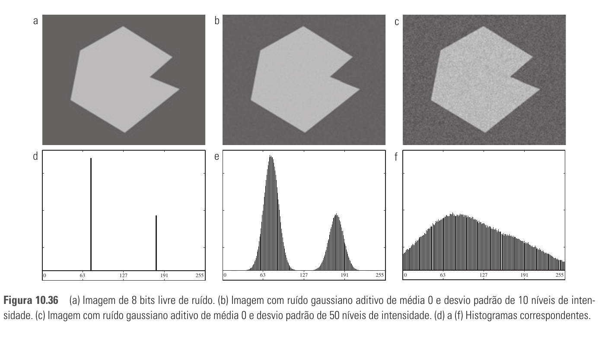
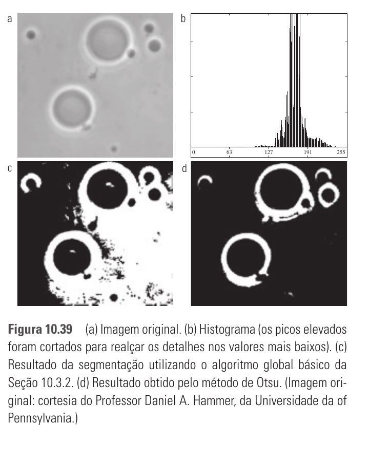

# 10.3 — Limiarização (Thresholding)

> Gonzalez & Woods, 3ª ed., cap. 10, p. 486–502 (PDF 504–520)

Categoria da **similaridade**, a mais simples e usada. Separa objeto de fundo
por um valor de corte `T`.

## 10.3.1 Fundamentos

Regra básica (limiarização **global** — um único T):

```
g(x,y) = 1 (objeto)  se f(x,y) > T
         0 (fundo)   se f(x,y) ≤ T
```

Funciona bem quando o **histograma é bimodal**: dois picos (fundo e objeto)
separados por um **vale** → coloca-se `T` no vale.



Repare: com pouco ruído o histograma (e) mantém o vale → dá pra limiarizar. Com muito ruído (f) vira um borrão unimodal → **impossível** achar T só pelo histograma.

- **Múltiplos limiares:** `T1, T2` → 3+ classes (histograma multimodal).
- O sucesso depende de: separação dos picos, largura do vale, **ruído** e
  **iluminação não-uniforme** (borram/deslocam os picos e destroem o vale).

Nomenclatura de T:
- **Global** — T fixo para a imagem toda.
- **Variável / local / regional** — T muda conforme a posição (x,y).
- **Dinâmica / adaptativa** — T depende de propriedades da vizinhança de (x,y).

## 10.3.2 Limiarização global simples (algoritmo iterativo)

Acha T automaticamente quando o histograma tem vale nítido:

1. Estimar um T inicial (ex.: intensidade média da imagem).
2. Segmentar: `G1 = pixels > T`, `G2 = pixels ≤ T`.
3. Calcular as médias `m1` (de G1) e `m2` (de G2).
4. Novo limiar: `T = ½(m1 + m2)`.
5. Repetir 2–4 até `|ΔT| < ΔT₀` (convergência).

Simples e eficaz quando fundo e objeto são bem separados. Ex. do livro: impressão digital → converge em 3 iterações, T≈125.

## 10.3.3 Limiarização global ótima — método de Otsu ⭐

**O método clássico de prova.** Escolhe `k*` que **maximiza a variância entre
classes** `σ²_B(k)` — equivale a **minimizar a variância dentro das classes**.

Intuição: o melhor limiar é o que deixa os dois grupos de pixels o **mais
separados estatisticamente** possível.

- `σ²_B(k)` é grande quando as médias das duas classes `m1`, `m2` estão distantes.
- **Medida de separabilidade:** `η = σ²_B / σ²_G` (variância global), com `0 ≤ η ≤ 1`. Quanto maior, melhor a separação.

Algoritmo:
1. Histograma **normalizado**, componentes `pᵢ`.
2. Somas acumuladas `P1(k)`.
3. Médias acumuladas `m(k)`.
4. Média global `m_G`.
5. Variância entre classes `σ²_B(k)` para todo `k`.
6. `k*` = valor de `k` que **maximiza** `σ²_B` (se empatar, média dos k's).
7. Separabilidade `η*` em `k*`.

**Otsu > global básico** quando o histograma **não tem vale claro** (ex.: células com fundo próximo do objeto — básico deu T=169 e falhou; Otsu deu T=181 e segmentou). Quando o histograma já é bem bimodal, os dois dão quase o mesmo T.



O histograma (b) é unimodal (sem vale) → o global básico (c) enche de erros; Otsu (d) acha o corte ótimo maximizando `σ²_B`.

## 10.3.4 Suavizar a imagem antes

Ruído "engorda" e mistura os picos do histograma. **Suavizar** (filtro de média)
antes de limiarizar volta a separar os modos → melhora muito. Cuidado: em
objetos muito pequenos a suavização pode apagá-los.

## 10.3.5 Usar bordas para melhorar o histograma

Se objeto e fundo têm áreas muito diferentes, o pico menor some no histograma.
Solução: considerar **só os pixels próximos das bordas** (alto gradiente/Laplaciano).
Isso equilibra as contagens → histograma vira bimodal e nítido, e aí Otsu/global funcionam.

## 10.3.6 Múltiplos limiares

Otsu generaliza para 2 limiares (`k1, k2`) maximizando `σ²_B(k1,k2)` → 3 classes.
Escala mal para muitas classes (busca fica cara); aí usa-se outras técnicas.

## 10.3.7 Limiarização variável (T local)

Quando ruído/iluminação não são resolvidos por pré-processamento global:

- **Particionamento da imagem** — subdivide em retângulos pequenos (onde a
  iluminação é ~uniforme) e aplica um T por retângulo. Simples; falha se o objeto
  não couber bem nos blocos.
- **T local por propriedades da vizinhança** — para cada pixel, calcula média
  `m_xy` e desvio `σ_xy` de uma janela e define `T_xy = a·σ_xy + b·m_xy`.
- **Médias móveis (moving averages)** — T segue a média móvel ao longo da
  varredura (linha a linha, em zigue-zague). Ótimo para **iluminação não-uniforme**
  e texto manuscrito/documentos.

## 10.3.8 Limiarização com múltiplas variáveis

Usa mais de uma grandeza por pixel (ex.: canais RGB → espaço 3-D). O "limiar" vira
uma **região no espaço multidimensional** (ex.: esfera em RGB) que define quem é objeto.

## Fio condutor

```
Histograma bimodal? ── sim ──► global (iterativo ½(m1+m2)) ou Otsu
                    └─ não ──► melhorar histograma:
                                 • suavizar (10.3.4)
                                 • usar bordas   (10.3.5)
Iluminação não-uniforme? ─────► limiarização VARIÁVEL (partição / média móvel)
Otsu = maximizar variância entre classes σ²_B  ★
```
