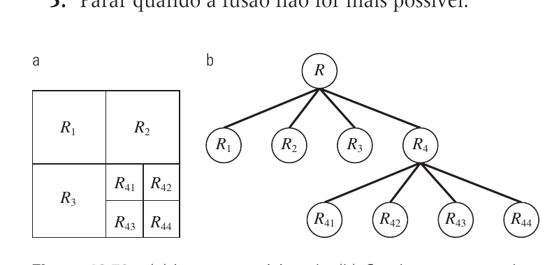

# 10.4 — Segmentação Baseada na Região

> Gonzalez & Woods, 3ª ed., cap. 10, p. 502–506 (PDF 520–524)

Categoria da **similaridade**, mas agora agindo **direto nas regiões** (em vez de
achar bordas ou limiarizar o histograma global). Duas abordagens: fazer regiões
**crescerem** ou **dividir e fundir**.

## 10.4.1 Crescimento de região (region growing)

Parte de **sementes (seeds)** e anexa vizinhos "parecidos" até não poder mais.

**Ingredientes:**
- Sementes `S(x,y)` — pontos iniciais (marcados com 1).
- Predicado `Q` de similaridade. Ex.: `Q = VERDADEIRO se |I(vizinho) − semente| ≤ T`.
- Conectividade (ex.: 8-conexos) — **essencial**: sem ela, pixels espalhados e
  desconexos entrariam na mesma "região" (resultado ilusório).
- Regra de parada — quando nenhum vizinho novo satisfaz `Q`.

**Algoritmo (versão do livro):**
1. Achar componentes conexos em `S` e erodir cada um a **1 pixel** (rótulo 1).
2. Formar `fQ(x,y) = 1` onde a imagem satisfaz a propriedade `Q`; senão 0.
3. `g` = anexar a cada semente todos os pontos com valor 1 em `fQ` que estejam
   **8-conectados** à semente.
4. Rotular cada componente conexo de `g` com um rótulo de região distinto → imagem segmentada.

**Como escolher sementes:** por conhecimento do problema (ex.: em raio-X de solda,
os defeitos são bem mais claros → sementes = pixels acima de um limiar alto). `Q`
pode comparar contra a **média da região já crescida** e até usar forma, não só intensidade.

## 10.4.2 Divisão e fusão de região (split & merge)

Não precisa de sementes. Usa uma **quadtree** (quadárvore): cada nó tem 4 filhos.

**Split (dividir — top-down):**
1. Comece com a imagem inteira `R`.
2. Se `Q(Rᵢ) = FALSO` (região heterogênea) → divida em **4 quadrantes**.
3. Repita recursivamente em cada quadrante até todos serem homogêneos (`Q=V`) ou atingir o tamanho mínimo.

**Merge (fundir — bottom-up):**
4. Funda regiões **adjacentes** `Rᵢ, Rⱼ` cuja união ainda satisfaz `Q(Rᵢ ∪ Rⱼ)=V`.
5. Pare quando não houver mais fusões possíveis.



**Simplificação prática:** funde `Rᵢ` e `Rⱼ` se **cada uma** satisfaz `Q`
individualmente (em vez de testar a união) → bem mais rápido e ainda funciona bem.

Combina o **top-down** (split) com o **bottom-up** (merge): split resolve regiões
grandes heterogêneas, merge junta os fragmentos pequenos homogêneos.

## Crescimento × Divisão-e-fusão

| | Crescimento de região | Divisão e fusão |
|---|----------------------|-----------------|
| Início | sementes (precisa escolher) | imagem inteira |
| Direção | bottom-up (cresce) | top-down (split) + bottom-up (merge) |
| Estrutura | vizinhança/conectividade | quadtree |
| Fraco em | escolha de semente + parada | fronteiras "em bloco" da quadtree |

## Fio condutor

```
Região = agir direto no interior homogêneo (não na borda)
  ├─ Crescimento: seed → anexa vizinhos 8-conexos com |I−seed|≤T
  └─ Split & merge: quadtree — divide se heterogêneo, funde adjacentes homogêneos
```
