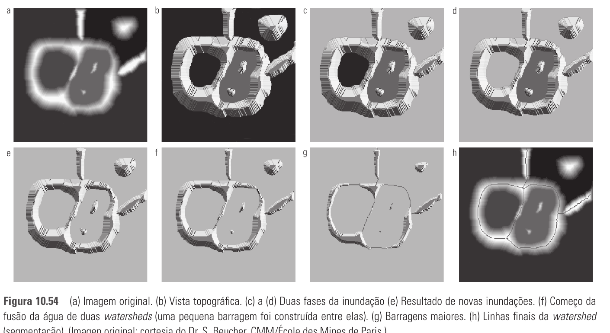
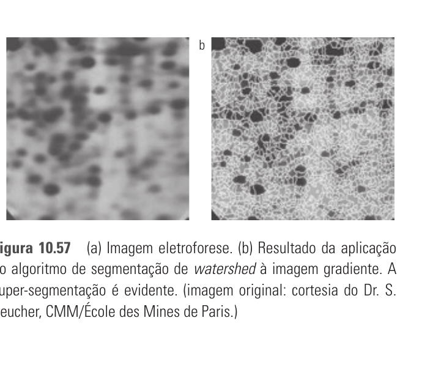
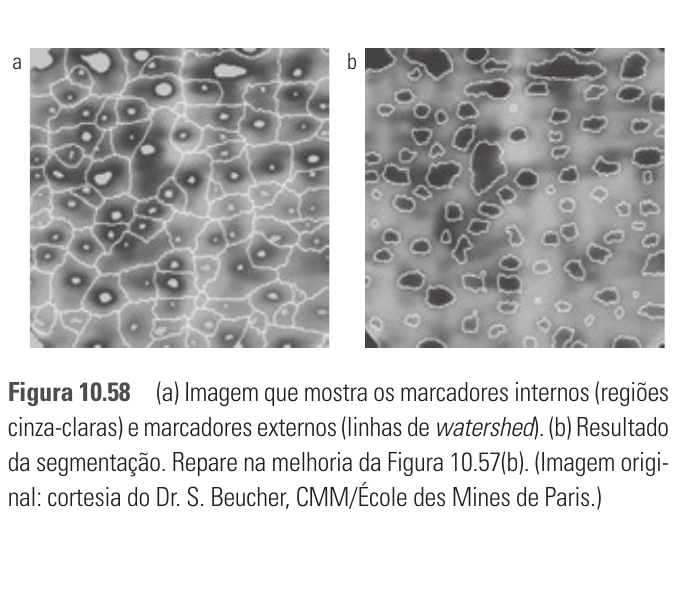

# 10.5 — Segmentação por Watersheds Morfológicas

> Gonzalez & Woods, 3ª ed., cap. 10, p. 506–511 (PDF 524–529)

Une os três conceitos anteriores: **detecção de bordas + limiarização +
crescimento de região**. Dá fronteiras **conexas e fechadas** (vantagem central).

## 10.5.1 Apresentação — a metáfora do relevo

Interpreta a imagem como **superfície topográfica 3D**: intensidade = altitude.
(Normalmente aplica-se ao **gradiente** da imagem, não à imagem em si — assim os
objetos viram vales cercados por "montanhas" nas bordas.)

Três tipos de ponto:
- (a) **mínimo regional** — fundo de um vale.
- (b) pontos de onde a água escorreria para **um único mínimo** → formam a
  **bacia hidrográfica** (*catchment basin* / watershed) daquele mínimo.
- (c) pontos onde a água cairia igualmente para **mais de um mínimo** → formam as
  **linhas de divisão** (*watershed lines*) = as fronteiras de segmentação.

**Metáfora da inundação:** fura-se cada mínimo e enche-se de água **de baixo para
cima**, uniformemente. Quando águas de duas bacias vizinhas estão prestes a se
juntar, **ergue-se uma barragem (dam)**. Ao fim, as barragens = as linhas de
watershed = a segmentação.



## 10.5.2 Construção das barragens

Feita por **dilatação morfológica** dos conjuntos conexos de cada bacia, na etapa
de inundação `n`, sujeita a 2 condições:
1. A dilatação fica **restrita à região inundada** (`q`, do estágio de inundação).
2. A dilatação **não pode fundir** dois conjuntos (não avança em pontos que
   uniriam bacias distintas).

Os pontos onde a dilatação seria proibida (senão fundiria as bacias) formam a
**barragem** — de 1 pixel de espessura. É onde as duas águas se encontrariam.

## 10.5.3 Algoritmo de segmentação de watershed

- Trabalha sobre `g(x,y)` = tipicamente a **imagem gradiente**.
- Inunda por níveis crescentes de intensidade `n` (de `mín` a `máx`), usando o
  **histograma** para saber quais níveis existem (eficiência).
- Em cada nível, expande as bacias `C(Mᵢ)`; quando duas se tocariam, constrói
  barragem.
- Resultado: **linhas de watershed** = caminhos brancos **conexos** sobre o gradiente.

## 10.5.4 Uso de marcadores (o ponto mais cobrado)

**Problema: super-segmentação (over-segmentation).** Ruído e irregularidades do
gradiente criam **mínimos locais demais** → regiões demais, resultado inútil
(ex.: imagem de eletroforese vira uma bagunça de fronteiras).



**Solução: marcadores.** Um marcador é um componente conexo que restringe de onde
a inundação começa:
- **Marcadores internos** — dentro dos **objetos** de interesse (ex.: região
  cercada por pontos mais altos, conexa, homogênea).
- **Marcadores externos** — no **fundo** (ex.: as próprias linhas de watershed de
  uma segmentação preliminar separando os objetos).

Procedimento: (1) **pré-processar** (suavizar para matar mínimos irrelevantes) e
(2) definir critérios que os marcadores devem satisfazer. Só os mínimos marcados
podem gerar bacias → **controla a super-segmentação**.



## Fio condutor

```
Imagem → gradiente → relevo 3D (intensidade = altitude)
Inundar de baixo p/ cima; barragem onde 2 bacias se encontram (dilatação restrita)
Barragens = linhas de watershed = fronteiras CONEXAS e fechadas
Problema: super-segmentação (mínimos demais)
Solução:  MARCADORES (internos=objeto, externos=fundo) + suavização
```

**Vantagem sobre bordas/threshold:** contornos sempre **fechados e conexos**.
**Desvantagem:** super-segmentação — resolvida por marcadores.
