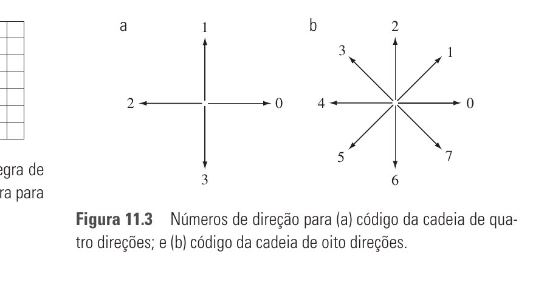
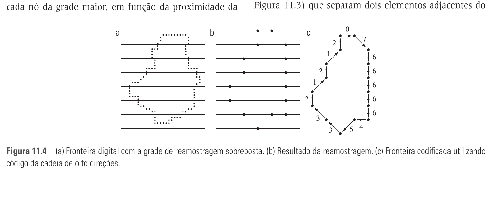

# 11.1 — Representação

> Gonzalez & Woods, 3ª ed., cap. 11, p. 523–536 (PDF 541–554)
> ⚠️ **11.1.7 Esqueletos está FORA da prova.**

Depois de segmentar, é preciso **representar** a região de forma útil para
descrevê-la. Duas escolhas: representar pela **fronteira** (características
externas — forma) ou pela **região** (características internas — cor, textura).
Esta seção foca na **fronteira**.

## 11.1.1 Seguidor de fronteira (boundary following / Moore)

Algoritmo que percorre a fronteira de uma região binária em ordem (horário),
produzindo a sequência de pixels de borda. Requisitos: região `R` com 1s (objeto)
e 0s (fundo), fronteira fechada.

Ideia: parte do pixel de borda mais acima-à-esquerda `b0`, e a cada passo procura
o próximo pixel de fronteira girando a partir do último pixel de fundo visitado.
Para quando **retorna ao ponto de partida** `b0` (com a regra correta de parada:
revisitar `b0` **e** o próximo pixel `b1`, para não parar cedo demais).

## 11.1.2 Códigos da cadeia (chain codes) ⭐ [Q3 da prova]

Representa a fronteira por uma **sequência de direções** entre pixels conectados.

- **Freeman chain code**: numera as direções (Fig. 11.3):
  - **4-direções**: 0=→, 1=↑, 2=←, 3=↓
  - **8-direções**: 0=→, 1=↗, 2=↑, 3=↖, 4=←, 5=↙, 6=↓, 7=↘
- Percorre a fronteira (ex.: sentido horário) e anota a direção de cada segmento.



**Problemas do código bruto e suas correções (normalização):**

| Problema | Sintoma | Correção |
|----------|---------|----------|
| Ruído / cadeia longa | código enorme e sensível a ruído | **reamostrar** a fronteira numa grade maior |
| Depende do **ponto de partida** | mesmo objeto → códigos diferentes se começa em outro pixel | **inteiro de magnitude mínima** (rotação circular) |
| Depende da **rotação** | objeto girado → código diferente | **primeira diferença** do código |

### Primeira diferença (invariância à rotação)
Conta quantas **mudanças de direção** (em sentido anti-horário) separam dois
elementos adjacentes da cadeia. Fórmula:

```
d[i] = (c[i] − c[i−1]) mod N      (N=4 ou N=8 direções)
```

Tratando como **sequência circular**, o primeiro elemento usa a transição entre
o último e o primeiro código.

> Ex. (4-dir): código `10103322` → 1ª diferença circular = `33133030`.
> Verificação: (1−2)=3, (0−1)=3, (1−0)=1, (0−1)=3, (3−0)=3, (3−3)=0, (2−3)=3, (2−2)=0.

### Inteiro de magnitude mínima (invariância ao ponto de partida)
Trata o código (ou a 1ª diferença) como **circular** e rotaciona até obter o
**menor número** possível lido como inteiro.

> Ex.: `33133030` como circular → menor rotação = `03033133` (começa no menor dígito
> possível formando o menor número). Esse é o código normalizado.

### Procedimento completo de normalização (Q3)
1. Obter o código de cadeia percorrendo a fronteira (8 direções, sentido pedido).
2. **1ª diferença** (mod 8) tratando como circular → invariante à rotação.
3. **Inteiro de magnitude mínima** (rotação circular) → invariante ao ponto de partida.
4. **Comparar** dois objetos: se os códigos normalizados forem **iguais**, são a
   **mesma forma** (a menos de rotações múltiplas de 45° e do ponto de partida).



> ⚠️ Estas normalizações só são exatas se a fronteira for invariante à rotação em
> ângulos múltiplos das direções — na prática há pequenas diferenças por
> reamostragem/resolução.

## 11.1.3 Aproximações poligonais — polígono de perímetro mínimo (MPP)

Aproxima a fronteira por um **polígono** com o menor nº de lados que ainda captura
a forma essencial. O **MPP** (minimum-perimeter polygon) é o polígono de menor
perímetro contido numa "faixa" (células) que envolve a fronteira.

- Intuição da faixa: como esticar um elástico dentro do corredor de células que
  segue a fronteira → ele encosta nos cantos.
- Vértices do MPP coincidem com **cantos convexos** (internos) e **côncavos**
  (externos) do corredor. Quanto menor a célula, mais fiel (e mais vértices).

## 11.1.4 Outras aproximações poligonais

- **Fusão (merging)**: vai juntando pontos ao longo da fronteira enquanto o erro
  de ajuste de reta fica abaixo de um limiar; ao estourar, fecha um lado e recomeça.
- **Divisão (splitting)**: liga os dois extremos, acha o ponto mais distante da
  reta; se passar do limiar, divide ali (recursivo). Bom para capturar cantos.

## 11.1.5 Assinaturas (signatures)

Representação **1-D** da fronteira 2-D → mais fácil de comparar.
Clássica: **distância do centroide à fronteira em função do ângulo θ** (`r(θ)`).

- **Invariante à translação** (usa o centroide).
- **Rotação** desloca a assinatura → normaliza escolhendo um ponto de partida
  fixo (ex.: ponto mais distante do centroide).
- **Escala** muda a amplitude → normaliza pela variância/amplitude.
- Ex.: círculo → `r(θ)` constante; quadrado → onda periódica com 4 mínimos/máximos.

## 11.1.6 Segmentos de fronteira (casca convexa)

Decompõe a fronteira usando a **casca convexa (convex hull)** `H` da região `S`.
A **deficiência convexa** `D = H − S` (as "reentrâncias") parte a fronteira em
segmentos nos pontos onde ela entra/sai da deficiência → descreve reentrâncias e
saliências de forma robusta. Suavizar antes evita partições espúrias por ruído.

## ~~11.1.7 Esqueletos~~ — FORA DA PROVA

## Fio condutor

```
Fronteira → seguidor de fronteira (sequência de pixels)
  ├─ Código de cadeia (Freeman 4/8 dir)
  │     normalizar: 1ª diferença (rotação) + magnitude mínima (ponto de partida)
  ├─ Aproximação poligonal: MPP / merge / split
  ├─ Assinatura: r(θ) → curva 1-D
  └─ Segmentos: casca convexa + deficiência convexa
```
