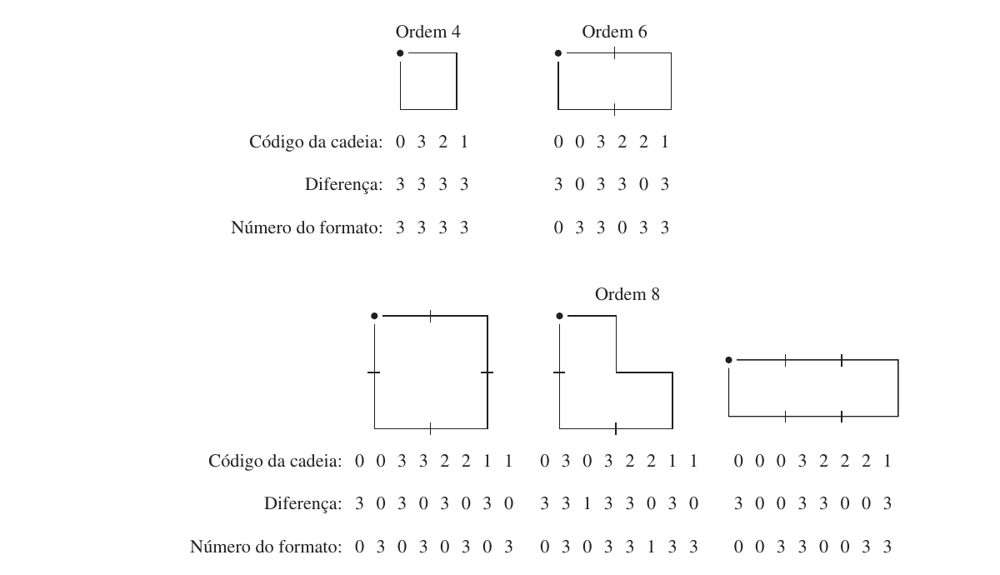

# 11.2.1 — Descritores simples de fronteira

> Gonzalez & Woods, 3ª ed., cap. 11, p. 537 (PDF 555)
> (Escopo da prova: **só 11.2.1**. Número do formato = 11.2.2, incluído aqui só
> como ponte para a Q3.)

Um **descritor** resume a fronteira em números/rótulos que permitem comparar formas.
Os mais simples:

## Comprimento (length)
Nº de pixels ao longo da fronteira ≈ comprimento. **Exato** via código de cadeia
com espaçamento unitário:

```
comprimento = (nº de componentes horizontais + verticais) + √2 · (nº de componentes diagonais)
```

(pois cada passo diagonal cobre `√2` e cada passo reto cobre `1`).

## Diâmetro, eixo maior e menor
- **Diâmetro:** maior distância entre dois pontos da fronteira.
  `Diâm(B) = máxᵢⱼ D(pᵢ, pⱼ)` (D = medida de distância).
- **Eixo maior:** o segmento que liga os dois pontos extremos do diâmetro.
- **Eixo menor:** perpendicular ao eixo maior, com comprimento tal que uma caixa
  passando pelos 4 pontos externos envolve toda a fronteira.
- **Retângulo básico:** essa caixa (alinhada aos eixos maior/menor).

## Excentricidade
`excentricidade = eixo maior / eixo menor`. Mede o quão "alongada" é a forma
(círculo → ~1; elipse fina → grande).

## Curvatura
Taxa de mudança da **inclinação** ao longo da fronteira. Difícil de medir bem em
fronteira digital (é "rugosa"). Prática: usar a **diferença de inclinação entre
segmentos de reta adjacentes** (nos vértices de uma aproximação poligonal).

Percorrendo em **sentido horário**, num vértice `p`:
- mudança de inclinação **≥ 0** → `p` é parte de segmento **convexo**;
- mudança **< 0** → parte de segmento **côncavo**;
- mudança **< 10°** → quase reto; mudança **> 90°** → canto (corner).

## Ponte → Número do formato (shape number, 11.2.2) — relevante p/ Q3

O **número do formato** é a **1ª diferença de menor magnitude** de um código de
cadeia (exatamente a normalização da nota [[11.1-representacao]]).

- **Ordem `n`** = número de dígitos. É **par** para fronteira fechada.
- Independente da **rotação** (por ser 1ª diferença) e do **ponto de partida** (por
  ser de menor magnitude).
- Duas fronteiras com o **mesmo número do formato** = **mesma forma**.

A Fig. 11.17 lista todos os formatos de ordem 4, 6 e 8 com seu código de cadeia,
1ª diferença e número do formato — **a melhor referência para a Q3**:



> Q3: obter código de cadeia (8-dir, sentido pedido) → 1ª diferença → menor
> magnitude → comparar com o código dado. Iguais ⇒ mesmo objeto.

## Resumo

```
Comprimento  = retos + √2·diagonais
Diâmetro     = max distância entre 2 pontos (→ eixo maior)
Eixo menor   ⊥ eixo maior → retângulo básico
Excentricidade = eixo maior / eixo menor
Curvatura    = mudança de inclinação nos vértices (convexo/côncavo/canto)
Número do formato = 1ª diferença de menor magnitude (invariante rotação+partida)
```
