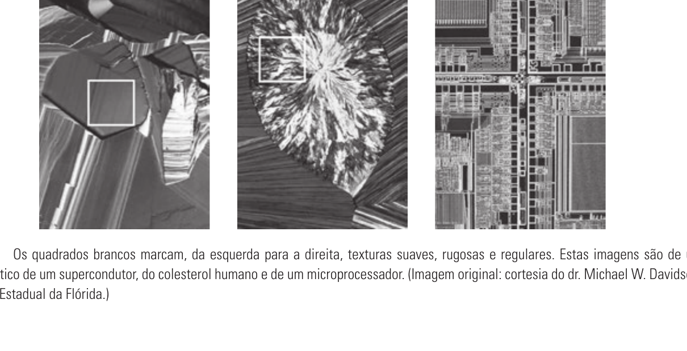

# 11.3 — Descritores Regionais

> Gonzalez & Woods, 3ª ed., cap. 11, p. 541–551 (PDF 559–569)
> ⚠️ **11.3.4 Momentos invariantes está FORA da prova.**

Descrevem a **região inteira** (interior), não só a fronteira. Três subseções na
prova: simples, topológicos e textura.

## 11.3.1 Alguns descritores simples

- **Área** = nº de pixels da região.
- **Perímetro** = comprimento da fronteira.
- **Compacidade** = `P² / A` — adimensional, invariante à escala e à rotação.
  (mínima para o círculo).
- **Razão de circularidade** `Rc = 4πA / P²` — razão entre a área da região e a de
  um círculo de mesmo perímetro. Vale **1 para círculo** e **π/4 (~0,785) para quadrado**.
- Outros: média/mediana de intensidade, mín/máx, nº de pixels acima/abaixo da média.

## 11.3.2 Descritores topológicos

**Topologia** = propriedades que **não mudam com deformações elásticas** (esticar/
dobrar sem rasgar/colar). Não dependem de distância.

- **H** = nº de **buracos**.
- **C** = nº de **componentes conexos**.
- **Número de Euler:** `E = C − H`.
  - Ex.: letra "A" → 1 componente, 1 buraco → `E = 0`. Letra "B" → 1 componente,
    2 buracos → `E = −1`.
- **Fórmula de Euler** (redes poligonais, com V vértices, Q arestas, F faces):
  ```
  V − Q + F = C − H = E
  ```
  Ex. da Fig. 11.26: 7 − 11 + 2 = 1 − 3 = −2.

## 11.3.3 Textura

Sem definição formal; mede **suavidade, rugosidade, regularidade**. Três abordagens:
**estatística**, **estrutural** e **espectral**.



### Abordagem estatística (momentos do histograma) — a principal
Sobre o histograma de intensidades `p(zᵢ)`, `i=0..L−1`:

| Descritor | Fórmula | O que mede |
|-----------|---------|------------|
| Média `m` | `Σ zᵢ p(zᵢ)` | intensidade média (pouco sobre textura) |
| Variância `σ² = μ₂` | `Σ (zᵢ−m)² p(zᵢ)` | **contraste** — base da rugosidade |
| Suavidade `R` | `R = 1 − 1/(1+σ²)` | **0** = área lisa (σ²=0); **→1** = textura rugosa |
| 3º momento `μ₃` | `Σ (zᵢ−m)³ p(zᵢ)` | **assimetria** do histograma (claro/escuro) |
| Uniformidade `U` | `Σ p²(zᵢ)` | máxima quando todos os níveis são iguais |
| Entropia `e` | `−Σ p(zᵢ) log₂ p(zᵢ)` | **aleatoriedade** (inverso da uniformidade) |

> Normalizar `σ²` por `(L−1)²` antes de usar em `R`. Textura suave → σ pequeno, R≈0,
> U alta, e baixa. Textura rugosa → o contrário.

### Limite das medidas de histograma e a matriz de co-ocorrência
Medidas só de histograma **ignoram a posição relativa** dos pixels. Para capturar
isso: **matriz de co-ocorrência de níveis de cinza** `G`, onde `gᵢⱼ` = nº de vezes
que um par de pixels com intensidades `i` e `j` ocorre numa **relação espacial**
fixa (ex.: "pixel à direita"). Dela extraem-se descritores (contraste, correlação,
homogeneidade, energia). Tamanho de `G` = L×L.

### Abordagem espectral (Fourier)
Usa o **espectro de Fourier** para detectar **periodicidade** da textura: picos de
alta energia no espectro revelam padrões repetitivos e sua orientação/frequência.

### 🔴 LBP — Local Binary Pattern (Q1b da prova) — NÃO está no Gonzalez
O **LBP** é um descritor de textura, mas **não aparece nesta seção** — vem dos
slides/material do professor. Ideia (estudar à parte):
- Para cada pixel central, compara com os **8 vizinhos**: vizinho `≥` centro → **1**,
  senão → **0**.
- Lê os 8 bits em ordem fixa (ex.: horário a partir do topo-esquerda) → **byte** →
  valor LBP do pixel (0–255).
- Histograma dos códigos LBP da região = descritor de textura, robusto a mudanças
  de iluminação.
> ➡️ Ver nota dedicada quando estudarmos os exercícios (Q1b pede o LBP de um pixel).

## ~~11.3.4 Momentos invariantes~~ — FORA DA PROVA

## Fio condutor

```
Região (interior) →
  Simples:     área, perímetro, compacidade P²/A, circularidade 4πA/P²
  Topológicos: E = C − H  (buracos e componentes; invariante a deformação)
  Textura:
    estatística → momentos do histograma (σ², R, U, entropia)
    co-ocorrência → posição relativa dos pixels (matriz G)
    espectral → Fourier (periodicidade)
    LBP → material à parte (Q1b)
```
