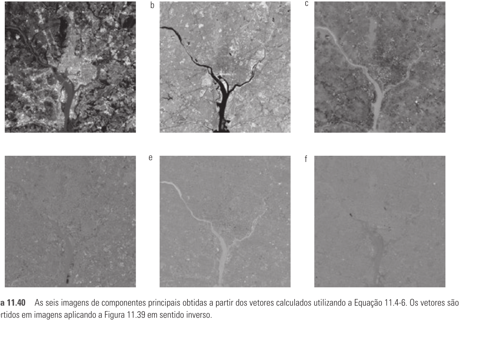

# 11.4 — Componentes Principais (PCA / Transformada de Hotelling)

> Gonzalez & Woods, 3ª ed., cap. 11, p. 552–557 (PDF 570–575)
> ⭐ Base da **Q4** (acelerar reconhecimento facial reduzindo dimensionalidade).

Ideia: representar cada amostra como um **vetor** e achar um novo sistema de eixos
(os **componentes principais**) que **descorrelaciona** os dados e concentra a
variância nas primeiras coordenadas → permite **reduzir dimensão** perdendo o mínimo.

## Montando os vetores
Cada objeto vira um vetor `x` de `n` dimensões. Ex.: em `n` imagens multiespectrais,
um pixel vira `x = [x₁,…,xₙ]ᵀ` (um valor por banda). Em faces, uma imagem `H×W` vira
um vetor de `n = H·W` valores.

## Vetor médio e matriz de covariância
Para uma população de `K` vetores:

```
mₓ = E{x}            ≈ (1/K) Σ xₖ                     (vetor médio, n×1)
Cₓ = E{(x−mₓ)(x−mₓ)ᵀ} ≈ (1/K) Σ xₖ xₖᵀ − mₓ mₓᵀ       (covariância, n×n)
```

- `Cₓ` é **real e simétrica** → sempre tem `n` autovetores **ortonormais**.
- Diagonal `cᵢᵢ` = variância de `xᵢ`; fora da diagonal `cᵢⱼ` = covariância entre
  `xᵢ` e `xⱼ` (0 ⇒ não correlacionados).

## Transformada de Hotelling (= PCA = Karhunen-Loève)
1. Achar autovetores `eᵢ` e autovalores `λᵢ` de `Cₓ` (`Cₓeᵢ = λᵢeᵢ`).
2. Ordenar em **ordem decrescente** de `λ`.
3. Montar `A` = matriz cujas **linhas são os autovetores** (1ª linha = autovetor do
   maior `λ`, última = do menor).
4. Transformar:

```
y = A (x − mₓ)
```

**Propriedades:**
- Média dos `y` é **zero** (`m_y = 0`).
- `C_y = A Cₓ Aᵀ` é **diagonal**, com os `λᵢ` na diagonal → os `y` são
  **descorrelacionados**. `Cₓ` e `C_y` têm os **mesmos autovalores**.
- Cada `λᵢ` = variância ao longo do i-ésimo componente principal.

## Reconstrução (exata)
Como as linhas de `A` são ortonormais, `A⁻¹ = Aᵀ`:

```
x = Aᵀ y + mₓ      (recupera x exatamente)
```

## Redução de dimensionalidade (o ponto da Q4)
Em vez de todos os `n` autovetores, use só os **`k` maiores** (maiores `λ`) →
matriz `Aₖ` (`k×n`). Então `y` é **k-dimensional** e a reconstrução é aproximada:

```
x̂ = Aₖᵀ y + mₓ
```

- **Erro** = soma dos `λ` descartados → a transformada de Hotelling é **ótima**:
  minimiza o **erro quadrático médio** entre `x` e `x̂` para um dado `k`.
- Poucos componentes (k ≪ n) já capturam quase toda a variância.

> **Exemplo multiespectral do livro (6 bandas):** autovalores
> `λ = 10344, 2966, 1401, 203, 94, 31`. Os **2 maiores** já respondem por **~89%
> da variância** → dá pra jogar fora 4 das 6 dimensões com perda mínima.



Repare (Fig. 11.40): a informação está nas primeiras componentes (a,b); as
últimas (d,e,f) são quase uniformes → **descartáveis**. É esse o princípio que
encolhe a face na Q4.

## Exemplo numérico (Ex. 11.14 do livro)
4 vetores: `x₁=(0,0,0)`, `x₂=(1,0,0)`, `x₃=(1,1,0)`, `x₄=(1,0,1)`.

```
mₓ = (3/4, 1/4, 1/4)ᵀ

        1  ⎡ 3   1   1 ⎤
Cₓ =  ─── ⎢ 1   3  −1 ⎥
       16  ⎣ 1  −1   3 ⎦
```

Diagonal igual → as 3 componentes têm a mesma variância. `x₁,x₂` e `x₁,x₃`
positivamente correlacionados; `x₂,x₃` negativamente.

## 🎯 Aplicação na Q4 — reconhecimento facial (eigenfaces)
Problema da prova: comparar uma foto nova contra **cada** face 2048×2048 da base,
sequencialmente → 30 s. Duas alavancas:

1. **PCA / eigenfaces (esta seção):** projetar cada face num espaço de **k
   componentes principais** (k ~ dezenas). Cada face vira um vetor pequeno de
   coeficientes. A comparação passa de `2048×2048 ≈ 4M` valores para `k` valores →
   **muito mais rápida por comparação**, e ainda remove ruído/redundância.
2. **Reduzir o nº de comparações:** indexar os vetores reduzidos (k-d tree, hashing)
   em vez de varrer a base inteira `O(N)` → busca aproximada `O(log N)`.

> Resposta ideal da Q4 = PCA para encolher cada face + estrutura de índice para não
> comparar contra todas. O gargalo é o vetor gigante **e** a varredura linear; PCA
> ataca o primeiro, indexação ataca o segundo.

## Fio condutor

```
Objeto → vetor x (n-dim)
mₓ, Cₓ → autovetores/autovalores de Cₓ (ordenar por λ decrescente) → A
y = A(x−mₓ)   → descorrelaciona, concentra variância nos 1ºs eixos
x = Aᵀy + mₓ  → reconstrução exata
usar só k maiores λ → reduz dimensão, MSE mínimo → base dos eigenfaces (Q4)
```
