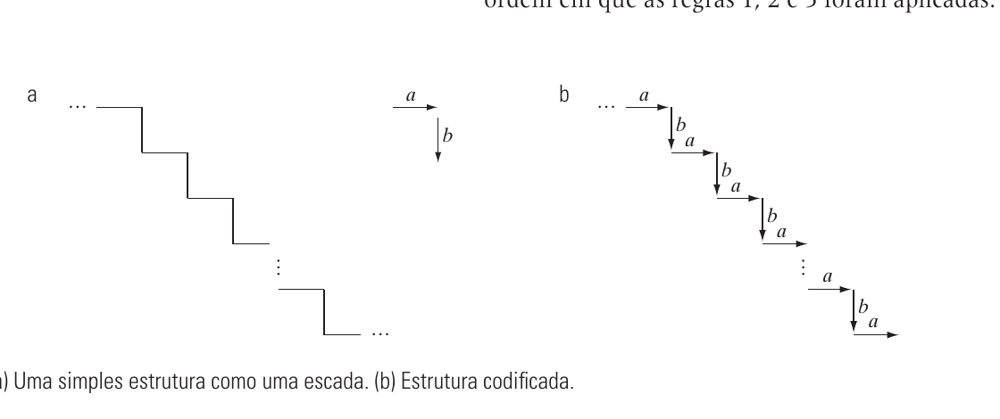

# 11.5 — Descritores Relacionais

> Gonzalez & Woods, 3ª ed., cap. 11, p. 562–566 (PDF 580–584)

Até aqui os descritores **mediam** propriedades (área, textura, código…). Os
**relacionais** descrevem a **estrutura**: como **primitivas** simples se conectam
umas às outras. É a base do **reconhecimento sintático de padrões** (usa gramáticas).

Ideia: escolher **primitivas** (peças básicas, ex.: segmentos de reta em direções
fixas) e uma **relação** entre elas → montar a forma como quem monta com blocos.

## Descritores de string (cadeia)

Para estruturas cuja conectividade é **1-D**, tipo **"cabeça à cauda"** (head-to-tail).

- Extraem-se segmentos de linha conectados do objeto; cada primitiva é um símbolo.
- A forma vira uma **string** (sequência de símbolos).
- Uma **gramática** (regras de reescrita) **gera/descreve** toda uma família de
  formas semelhantes com poucas regras.

**Exemplo da escada (Fig. 11.45–11.46):** primitivas `a` (segmento numa direção) e
`b` (na outra). Regras de reescrita:

```
1.  S → aA
2.  A → bS
3.  A → b
```



Começa no símbolo inicial `S` e aplica as regras até não sobrar variável:
`S → aA → abS → abaA → ababS → …` Cada aplicação acrescenta um degrau → **um número
infinito de escadas** descrito por 3 regras. `(~d)` denotaria a primitiva `d` com
sentido invertido.

> Strings servem bem quando as primitivas se encadeiam continuamente. Quando as
> partes **não são contíguas** (ex.: regiões separadas com mesma textura), string
> não basta → usa-se **árvore**.

## Descritores de árvore (tree)

Capturam relações **2-D / hierárquicas** que não cabem no encadeamento linear.

Uma **árvore `T`**: um nó **raiz `$`** e os demais nós divididos em subárvores.
Cada nó guarda **dois tipos de informação**:
1. **Sobre o nó** — o que aquela subestrutura é (uma região, um segmento…).
2. **Relação com vizinhos** — ponteiros que definem a relação física com outras
   subestruturas.

**Exemplo "dentro de" (Fig. 11.50):** regiões aninhadas.
- Raiz `$` = imagem toda; nível 1: `a` e `c` estão **dentro de** `$` → dois galhos.
- Nível 2: `b` dentro de `a`; `d` e `e` dentro de `c`.
- Nível 3: `f` dentro de `e`.

O aninhamento vira a hierarquia da árvore — a **relação** ("dentro de") é o que
descreve a imagem, não as medidas de cada região.

## Resumo

```
Descritor relacional = ESTRUTURA (como as primitivas se relacionam)
  String (1-D, cabeça-à-cauda):
      primitivas + gramática (regras de reescrita) → família de formas
      ex.: escada com S→aA, A→bS, A→b
  Árvore (2-D / hierárquica):
      nó = subestrutura; ponteiros = relação (ex.: "dentro de")
      ex.: regiões aninhadas → árvore
Base do reconhecimento sintático de padrões.
```
