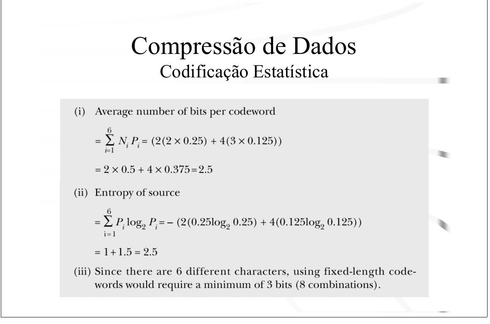
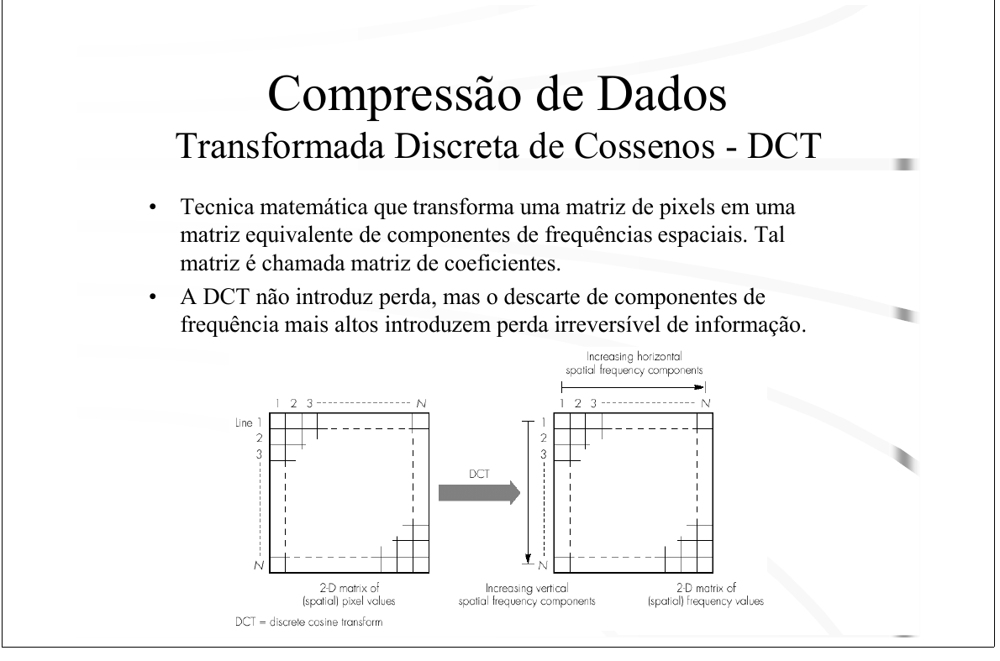

# Compressão de Dados — Motivação (slides moodle)

> `articles/silo.tips_topicos-compressao-de-dados-motivaao.pdf` (26 slides)
> Complementa a nota [[8.1-fundamentos-compressao]]. Foco no que é novo e cai na prova.

## Motivação — por que comprimir
Mídias exigem banda/armazenamento que muitas vezes não existe:
- **Imagem:** 18,9 Mbits (1024×768, 24 bpp); ~2,5 Mbits (VGA, 8 bpp).
- **Áudio:** 64 kbps (voz telefônica); 1,411 Mbps (CD stereo).
- **Vídeo:** ~332 Mbps (YCᵣC_b 4:2:2). → num DVD, precisa comprimir ~26×.

Também economiza tempo/custo de transmissão (redes com cobrança por dados).

## Modelo: Source Coder / Destination Decoder
`Informação origem → [Source encoder] → rede → [Destination decoder] → cópia`.
Compressão é feita **antes da transmissão**.

## Com perdas × sem perdas
- **Sem perdas (lossless):** recupera os dados **exatos**. Obrigatória p/ texto,
  dados. Usa **codificação por entropia**.
- **Com perdas (lossy):** recupera uma **aproximação**; explora limites do olho/
  ouvido humano. Usado em imagem/áudio/vídeo (maiores taxas).

## Codificação por entropia / estatística
Atribui **códigos curtos a símbolos frequentes** (tamanho variável). Duas medidas:

```
Entropia:            H = − Σ Pᵢ log₂ Pᵢ         (bits/símbolo — o mínimo teórico)
Nº médio de bits:    L = Σ Nᵢ Pᵢ                (Nᵢ = tamanho do código do símbolo i)
Eficiência:          η = H / L                  (ideal → 1)
```

### Exemplo resolvido (ótimo para a Q5)
6 símbolos: `M,F` com P=0,25 e `Y,N,0,1` com P=0,125. Códigos:
`M=10, F=11, Y=010, N=011, 0=000, 1=001`.

- **(i) Bits médios:** `L = Σ Nᵢ Pᵢ = 2·(2×0,25) + 4·(3×0,125) = 1,0 + 1,5 = 2,5`
- **(ii) Entropia:** `H = −[2·(0,25 log₂0,25) + 4·(0,125 log₂0,125)] = 1,0 + 1,5 = 2,5`
- **(iii) Tamanho fixo:** 6 símbolos → `⌈log₂6⌉ = 3 bits`.

`L = H = 2,5` ⇒ código **ótimo** (eficiência 100%); e ainda economiza 0,5 bit/símbolo
vs. os 3 bits do código fixo.



## Codificação por diferença → base da Delta Modulation (Q1a)
Quando a amplitude varia numa faixa larga, mas a **diferença entre amostras
sucessivas é pequena**: armazena a **diferença** para o valor anterior, não o valor.

- Sinal de 12 bits com diferenças ≤ 3 bits → economia de **75%**.
- Pode ser sem perdas (se os bits cobrem a maior diferença) ou com perdas.

### 🎯 Delta Modulation (o caso 1-bit — método da Q1a)
Caso extremo de codificação por diferença/DPCM: **1 bit por amostra**, passo fixo `δ`.
- Preditor = **valor reconstruído anterior**.
- Se amostra atual `≥` predição → sobe `+δ`; senão → desce `−δ`.
- Na prova: `+2 → 0`, `−2 → 1` (δ=2). Reconstrói acumulando ±2 a partir do 1º valor.
- Depois calcula-se o **MSE** entre a imagem reconstruída e a original
  (ver [[8.1-fundamentos-compressao]], fórmula do MSE).
- Erros típicos: **slope overload** (sinal sobe rápido demais p/ o passo acompanhar)
  e **ruído granular** (passo grande demais em áreas planas).

### DPCM / ADPCM (áudio, para referência)
- **DPCM** (Differential PCM): codifica a diferença predita; preditor de ordem baixa.
- **ADPCM** (Adaptive DPCM): passo/preditor **adaptativos** conforme a amplitude da
  diferença → menos bits (5–6 bits/amostra) com qualidade ~PCM. Padrões ITU-T G.722.

## Codificação por transformadas + DCT (detalhe no módulo JPEG)
- Transforma a informação p/ um formato mais compressível; **a transformada em si
  não perde**.
- **Frequência espacial** = taxa de mudança da intensidade dos pixels (horizontal/
  vertical). Olho é **menos sensível a altas frequências**.
- **DCT** transforma uma matriz de pixels numa **matriz de coeficientes** de
  frequência. A DCT não perde; a **perda vem do descarte/quantização** dos
  coeficientes de alta frequência.



## Compressão de texto (sem perdas)
- **Huffman (estática):** árvore binária construída pela frequência dos símbolos;
  0/1 nos galhos; símbolo nas folhas (código = caminho raiz→folha). Frequente →
  código curto. Ótima só se as probabilidades são potências de ½.
- **Huffman (dinâmica/adaptativa):** constrói a árvore conforme lê os caracteres
  (não precisa de 2 passadas nem enviar a tabela).
- **Codificação aritmética:** codifica a mensagem inteira num único número em
  [0,1); mais eficiente que Huffman, porém mais complexa.
- **LZW (Lempel-Ziv-Welch):** baseada em **dicionário**; começa com os caracteres
  básicos (ASCII) e adiciona sequências novas dinamicamente. Não precisa enviar o
  dicionário (decodificador reconstrói).

## Fio condutor

```
Motivação: mídias grandes demais p/ banda/armazenamento
Lossless (texto/dados)  →  entropia: Huffman, aritmética, LZW
Lossy (imagem/áudio/vídeo) → explora percepção humana
  diferença/DPCM → Delta Modulation (1 bit, ±δ)  → Q1a + MSE
  transformada/DCT → matriz de coeficientes, descarta altas freq. → Q5/JPEG
Eficiência: L = ΣNᵢPᵢ  vs  H = −ΣPᵢlog₂Pᵢ
```
