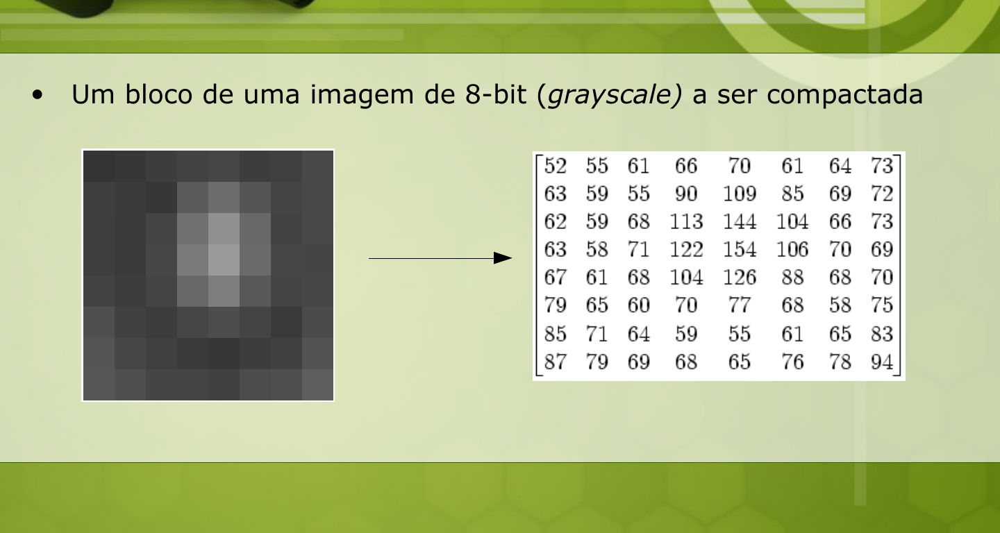
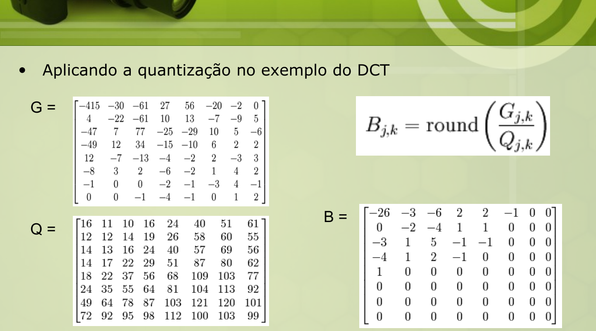
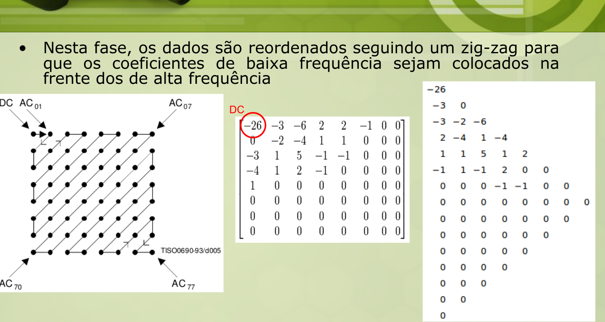

# JPEG (slides moodle UNIOESTE)

> `articles/Slides JPEG, Tópicos em Computação Gráfica, UNIOESTE, 2008.pdf`
> ⭐ Núcleo da **Q5**. Complementa [[8.1-fundamentos-compressao]] e [[compressao-motivacao]].

**JPEG** (Joint Photographic Experts Group): padrão de compressão **com perdas**
para fotos. Perda proporcional a um **coeficiente/fator de compressão** (guardado no
header). A imagem é vista como blocos (**data-units**) de **8×8 pixels**.

Visão geral: `Imagem → Transformada → Quantização → Codificação → Comprimida`.

## As 5 etapas

### 1. RGB → YCbCr
RGB tem canais muito correlacionados. Converte-se p/ **luminância Y** (tons de cinza)
+ **crominâncias Cb** (azul) e **Cr** (vermelho), que são pouco ligadas entre si.

### 2. Downsampling (subamostragem de croma) — 1ª perda
Olho é **mais sensível à luminância** que à cor → descarta-se parte de Cb/Cr.
- Proporção ex.: **4:1:1** (4 amostras de Y para 1 de Cb e 1 de Cr).
- Data-unit de `64+64+64 = 192 bytes` → `64+16+16 = 96 bytes` → **−50%** com perda imperceptível.

### 3. DCT2 (transformada discreta de cossenos 2D) — sem perda
Em cada bloco 8×8:
- **Nível-shift**: normaliza de `[0,255]` para `[−128,127]` (subtrai 128).
- Aplica DCT2 → **matriz de coeficientes** (frequência espacial). O canto
  superior-esquerdo = **DC** (média, baixa freq.); resto = **AC** (altas freq.).
- A DCT **não perde**; concentra energia → **maioria dos coeficientes fica perto de zero**.



### 4. Quantização — 2ª perda (a principal!)
Divide cada coeficiente pela **matriz de quantização Q** e arredonda:

```
B[j,k] = round( G[j,k] / Q[j,k] )      G = coef. DCT,  Q = matriz de quantização
```

- É aqui que o arquivo **encolhe drasticamente**: muitos coeficientes viram **0**.
- **Irreversível** (a perda de detalhe do JPEG mora aqui).
- Q padrão do JPEG tem valores **pequenos no canto DC** (preserva baixa freq.) e
  **grandes nas altas freq.** (descarta detalhe fino). Q pode ser trocada (vai no header);
  Q maior → mais compressão, menos qualidade (= "fator de qualidade").



### 5. Codificação por entropia
Ordena e comprime os coeficientes quantizados:

**a) Zig-zag:** lê o bloco 8×8 em **zigue-zague** (do DC no canto sup-esq para AC₇₇),
agrupando as **baixas frequências na frente** e deixando os zeros (altas freq.) no fim.



**b) DC — codificação diferencial (DPCM):** o DC de cada bloco é codificado como a
**diferença** para o DC do bloco anterior: `DIFF = DCᵢ − DCᵢ₋₁` (DCs de blocos
vizinhos são parecidos → diferença pequena).

**c) AC — RLE (Run-Length Encoding):** os **zeros consecutivos** dos AC são agrupados.

**d) Huffman (ou aritmética):** códigos de tamanho variável sobre o resultado.
- Ex. do slide: string `10A 5B 5C` → árvore → `a=1, b=00, c=01`.
- No header vão **4 tabelas de Huffman**: `Y/DC, CbCr/DC, Y/AC, CbCr/AC`
  (DC e AC usam tabelas diferentes; cada componente Y e CrCb tem a sua).

## 🎯 Formato do RLE do JPEG (o que a Q5 pede)

O RLE dos **AC** (em zig-zag) usa pares **(RUN, VALOR)**:
- **RUN** = quantos zeros vêm **antes** do próximo coeficiente não-nulo.
- **VALOR** = o coeficiente não-nulo.
- **EOB** (End Of Block) = marca quando **todo o resto é zero** (fecha o bloco).

> Parâmetros que influenciam o nº de bits: (1) **quantidade de coeficientes
> não-nulos**; (2) **magnitude** de cada um (valor maior → categoria/SIZE maior →
> mais bits); (3) **tamanho dos runs de zeros** (mais zeros seguidos → RLE+EOB
> economizam muito); (4) a **matriz de quantização / fator de qualidade**.

### Aplicando à Q5 (dois blocos de AC em zig-zag)
- **Bloco A** = `[10, −5, 0, 0, 2, 0, 0, …]`:
  `(0,10) (0,−5) (2,2) EOB` → poucos símbolos, muitos zeros colapsados → **fluxo pequeno**.
- **Bloco B** = `[1, 1, −1, 1, 1, −1, …]` (todos não-nulos):
  `(0,1)(0,1)(0,−1)(0,1)…` → **15 pares**, nenhum zero p/ o RLE aproveitar, sem EOB →
  **fluxo grande**.
- **Conclusão:** o **Bloco A** gera menos bits — o RLE+EOB explora seus zeros; o
  Bloco B não tem zeros nem redundância, então o RLE não ajuda (e ainda tem muitos
  coeficientes não-nulos p/ codificar).

## Fio condutor (pipeline)

```
RGB →[1] YCbCr →[2] downsampling croma (4:1:1, perda) →
blocos 8×8, shift −128 →[3] DCT2 (sem perda, energia no DC) →
[4] Quantização B=round(G/Q) (perda principal, vira zeros) →
[5] zig-zag → DC (DPCM: DCᵢ−DCᵢ₋₁) + AC (RLE: (run,valor)+EOB) → Huffman
```
