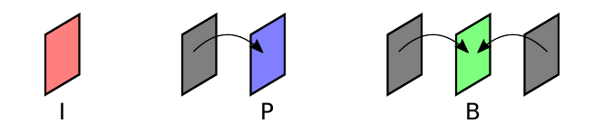
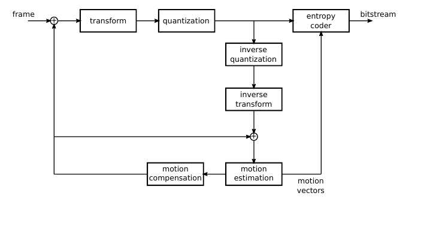

# Compressão de Vídeo (slides moodle — Bařina, "Video formats")

> `articles/video-formats-en.pdf` (46 slides)
> ⭐ Base da **Q2** (explicar um artefato de vídeo, causa e solução).

Vídeo = sequência de imagens (frames). Além da redundância **espacial** (dentro do
quadro, como no JPEG), explora a redundância **temporal** (entre quadros vizinhos,
que são quase iguais).

## Formato, contêiner, codec
- **Contêiner** — empacota o vídeo (ex.: AVI, Matroska, MPEG-TS).
- **Codec** — algoritmo de compressão/descompressão (ex.: H.264, MPEG-4; libs x264, DivX).
- Hierarquia: vídeo → GOP → frames → slices → **macroblocos** → blocos → amostras.

## Tipos de quadro (I / P / B) ⭐

| Frame | Nome | Usa redundância | Referência |
|-------|------|-----------------|------------|
| **I** | key / intra | **espacial** (só ele mesmo, tipo JPEG) | nenhuma — autônomo |
| **P** | inter / preditivo | **temporal** | prediz do quadro **anterior** |
| **B** | bidirecional | **temporal** | prediz do **anterior E do posterior** |

- **I-frame** é o maior (não comprime no tempo) mas é **decodificável sozinho**.
- **P/B** guardam só as **diferenças + vetores de movimento** → bem menores.
- **B-frame** exige **reordenação** (o quadro futuro de referência precisa ser
  decodificado antes) e pode ser descartado (framedrop) sem quebrar a cadeia.



## GOP (Group of Pictures)
Sequência de quadros que **começa com um I-frame**, seguida de P/B.
- **GOP fechado (closed):** qualquer quadro é decodificável **só com o próprio GOP**.
- **GOP aberto (open):** pode referenciar quadros de fora.
- Tamanho típico **12** (máx. ~18). GOP grande → **mais compressão**, mas
  **seeking lento** e menos resiliência a erro.

## Blocos e macroblocos
- **Bloco** = 8×8 amostras (unidade da **DCT**).
- **Macrobloco** = 16×16 Y + croma (ex.: 6 blocos em 4:2:0) → **unidade da
  compensação de movimento**. Em H.264 divide-se em subblocos (até 4×4).

## Estimação e compensação de movimento (o coração do inter-frame)
Explora a redundância temporal:
- **Motion Estimation (ME):** procura, no quadro de referência, o bloco mais
  parecido com o bloco atual.
- **Motion Vector (MV):** o deslocamento encontrado (precisão half-pel/Qpel,
  codificado diferencialmente). P-frame: 1 MV/macrobloco; B-frame: 2 MVs.
- **Motion Compensation (MC):** reconstrói o bloco a partir da referência + MV;
  guarda só o **resíduo** (diferença) + o vetor. Modos: global (GMC), por bloco
  (BMC), sobreposto (OBMC).

## Codificador híbrido (arquitetura)
Junta tudo num laço:
```
frame → (−) → transformada (DCT) → quantização → codificador de entropia → bitstream
                                        ↓
                            quant. inversa → transf. inversa → (+) → compensação de movimento
                                                                          ↑ estimação de movimento → vetores
```
"Híbrido" = combina **predição temporal** (movimento) com **codificação por
transformada** (DCT+quantização, como o JPEG). O laço de reconstrução garante que
codificador e decodificador partam da **mesma referência**.



## 🎯 Artefatos de vídeo (Q2) — o quê, por quê, solução

### 1. Interlacing / combing (pente) — em objetos em movimento
- **O quê:** linhas horizontais alternadas "rasgadas" (efeito pente/serrilhado) em
  bordas de objetos que se movem.
- **Por quê:** no vídeo entrelaçado, linhas **pares e ímpares** são capturadas em
  **instantes de tempo diferentes** (dois campos/fields). Se o objeto se moveu entre
  os dois, as linhas não casam → pente.
- **Solução:** **desentrelaçamento (deinterlacing)** — combinar/interpolar os campos;
  ou usar captura progressiva.

### 2. Blocking / macroblocking (blocos)
- **O quê:** a imagem aparece "quadriculada", blocos 8×8/16×16 visíveis, principalmente
  em cenas de movimento ou baixa taxa de bits.
- **Por quê:** **quantização agressiva** (Q alto / bitrate baixo) zera coeficientes
  DCT de alta frequência → cada bloco vira quase uniforme, e as bordas entre blocos
  ficam descontínuas.
- **Solução:** **filtro de deblocking** (loop filter, padrão no H.264), aumentar o
  **bitrate** / reduzir Q, blocos menores.

### 3. Propagação de erro temporal (smearing/persistência entre quadros)
- **O quê:** uma corrupção aparece e **persiste/arrasta por vários quadros** até
  "sarar" de repente. (Clássico "pequeno trecho de vídeo" com o defeito se propagando.)
- **Por quê:** P/B-frames são **preditos de um quadro de referência**. Se um I/P-frame
  chega corrompido/perdido na transmissão, **todos os quadros que dependem dele**
  herdam o erro — até o **próximo I-frame** reiniciar o GOP.
- **Solução:** **I-frames mais frequentes** (GOP menor), **GOP fechado**, mecanismos de
  **resiliência a erro** (slices, intra-refresh) e retransmissão/FEC no transporte.

> Como responder a Q2: identifique qual dos três a figura mostra (pente = interlacing;
> quadriculado = blocking; defeito que arrasta entre quadros = propagação de erro),
> e dê **causa + solução** correspondentes.

## Fio condutor

```
Redundância espacial (I-frame, DCT) + temporal (P/B, movimento)
GOP: começa com I; fechado = autossuficiente; tam. ~12
Macrobloco = unidade de movimento; bloco 8×8 = unidade DCT
ME → MV → MC (guarda resíduo + vetor)
Codificador híbrido = movimento + DCT/quantização num laço
Artefatos: interlacing(pente) · blocking(quantização) · propagação de erro(ref. perdida)
```
