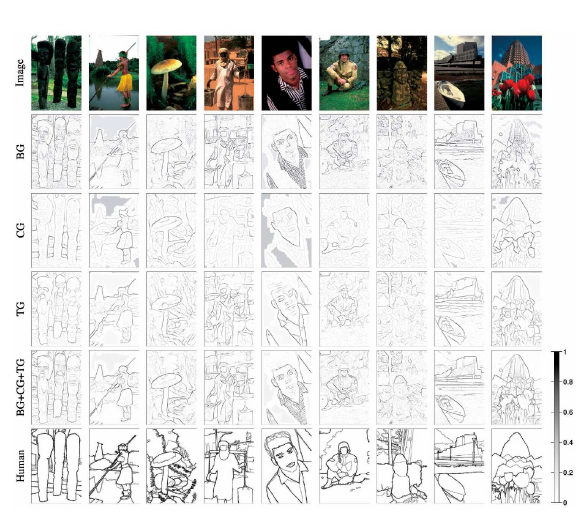
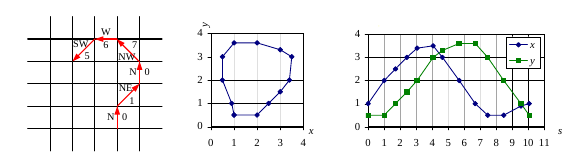

# Szeliski 7.2 — Edges and Contours (Bordas e Contornos)

> Szeliski, *Computer Vision*, 2ª ed., p. 455–465 (PDF 481–491)
> Visão **moderna/CV** das bordas — complementa Gonzalez 10.2 ([[10.2-deteccao-ponto-linha-borda]]).
> Foco aqui: **o que é novo** em relação ao Gonzalez.

## 7.2.1 Detecção de bordas

Bordas ocorrem em fronteiras entre regiões de cor/intensidade/textura diferentes.
Pensando na imagem como **campo de alturas** (height field), a borda é onde a
superfície tem **inclinação alta**.

### Gradiente e derivada de Gaussiana (a sacada de eficiência)
- **Gradiente** `J = ∇I` aponta na direção de **maior subida** da intensidade;
  magnitude = força da borda, direção = orientação.
- Derivada amplifica ruído → **suaviza-se com Gaussiana antes**.
- **Truque:** suavizar-e-derivar = **uma única convolução** com a **derivada da
  Gaussiana** (a derivada "passa" para o kernel). Gaussiana circularmente simétrica
  → usada na maioria dos detectores (base do Canny).
- **Filtros orientáveis (steerable filters)** (Freeman & Adelson): calculam a
  resposta em qualquer orientação a partir de poucas respostas-base.

### Afinar a borda (mesma ideia do Canny)
- **Supressão não-máxima:** mantém só os máximos da magnitude do gradiente na
  direção **perpendicular à borda** (ao longo do gradiente) → borda de 1 pixel.
- Equivalente a achar **cruzamentos por zero** da 2ª derivada na direção do gradiente.

### Laplaciano da Gaussiana (LoG) e DoG
- **LoG** = Laplaciano ∘ Gaussiana (Marr–Hildreth). Bordas = **zero crossings**.
- Na prática, aproxima-se o LoG por **Diferença de Gaussianas (DoG)** — barato,
  ainda mais se já existe uma **pirâmide Laplaciana/DoG**.
- Cada zero-crossing vira um **edgel** (elemento de borda) com posição, orientação e força.

### 🆕 Seleção de escala (novo vs. Gonzalez)
O parâmetro **σ** (escala da Gaussiana) define **que tamanho de detalhe** a borda
captura. Não existe σ único ideal:
- σ pequeno → pega detalhe fino + ruído; σ grande → só bordas grandes/suaves.
- **Elder & Zucker (1998):** dado o nível de ruído, computa por pixel a **escala
  mínima confiável** para gradiente e para 2ª derivada.
- **Scale-space:** detectar bordas em **várias escalas** e selecionar (Witkin,
  Lindeberg) quando há bordas em resoluções diferentes.

### 🆕 Bordas em cor e textura (novo vs. Gonzalez)
- Detectores em **tons de cinza falham** em bordas **isoluminantes** (mesma
  luminância, cores diferentes).
- Abordagens: rodar o detector em **cada canal** e combinar; ou **energia orientada**
  por banda; ou comparar **distribuições** de cor dos dois lados da borda.
- **Detector Pb (Martin, Fowlkes & Malik 2004):** combina **brilho + cor + textura**
  com detectores de **meio-disco orientados**, **treinado** para casar com
  fronteiras marcadas por humanos → estado da arte. Base para o **gPb** e para
  segmentação hierárquica por **watershed** (Arbeláez et al. 2011).



## 7.2.2 Detecção de contornos

Bordas isoladas viram mais úteis quando **ligadas em contornos contínuos**.

- **Ligação (linking):** pega um edgel não-ligado e segue os vizinhos nos dois
  sentidos, formando cadeias.
  - Se vieram de **zero crossings** → fácil (edgels adjacentes compartilham
    extremos).
  - Senão → usar **orientação/fase** dos edgels vizinhos para desambiguar.
- **Histerese** (Canny): dois limiares; um contorno acima do limiar alto pode
  "cair" até o limiar baixo → remove segmentos fracos sem quebrar contornos.
- **Codificação dos contornos** (Fig. 7.35) — conecta direto com o Gonzalez cap. 11:
  - **Código de cadeia** numa grade N8 (direções 0–7), comprimível com predição +
    run-length → é o [[11.1-representacao|código de cadeia de Freeman]].
  - **Parametrização por comprimento de arco (arc-length):** pontos do contorno
    viram pares `(x,y)` ao longo de `s` → pode reamostrar ou converter para
    **Fourier** (descritores de Fourier / assinaturas).



## 7.2.3 Aplicação: edição e realce de bordas

Guardando **magnitude + estimativa de borramento (blur)** de cada borda, dá pra
**editar/realçar** a imagem diretamente (ex.: aumentar nitidez, estilizar), não só
usar bordas para reconhecimento/casamento.

## Ponte com o Gonzalez

| Conceito | Gonzalez (cap. 10/11) | Szeliski 7.2 (novo) |
|----------|----------------------|---------------------|
| Gradiente/Sobel | 10.2.5 | derivada de Gaussiana, steerable |
| Canny (não-máx + histerese) | 10.2.6 | mesma ideia, formalizada |
| LoG / zero crossing | 10.2.6 | + aproximação DoG, edgels |
| Escala σ | fixo | **seleção de escala** (Elder-Zucker, scale-space) |
| Bordas | tons de cinza | **cor + textura** (detector Pb aprendido) |
| Ligação de bordas | 10.2.7 / Hough | linking + histerese + codificação |
| Código de cadeia | 11.1.2 | Fig. 7.35 (mesma coisa) + arc-length→Fourier |

## Fio condutor

```
Borda = alto gradiente (imagem como height field)
  suavizar+derivar = 1 convolução com derivada-de-Gaussiana
  afinar: supressão não-máxima (⊥ à borda) = zero crossing da 2ª deriv.
  LoG ≈ DoG → edgels
  🆕 seleção de ESCALA (σ) · 🆕 bordas de COR/TEXTURA (detector Pb)
Contorno = ligar edgels em cadeias + histerese
  codificar: código de cadeia (N8) ou arc-length → Fourier   (↔ Gonzalez cap. 11)
```
